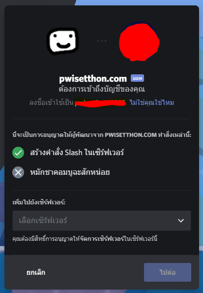

# Basic Troubleshoot



ปัญหาเกิดจากบอทอาจจะไม่ทำงานเพราะ

* ไฟที่ตั้งเซิฟเวอร์ดับ
* เน็ตที่ตั้งเซิฟเวอร์ไม่สามารถใช้งานได้
* เซิฟเวอร์ไม่ทำงาน

เป็นที่ API ของ สลากฯ หรือ เป็นที่ตัวบอทโดยไม่มีสาเหตุ

สามารถเช็คสถานะของดิสบอทได้ที่นี้ [status.teamquadb.in.th](https://status.teamquadb.in.th/) เมื่อดิสกลับมาทำงานในเวลา 15:00 ถึง 18:00 ดิสจะทำการส่งสลากฯให้ทันที ถ้าหลังจากเวลา 18:00 แล้วไม่มีการส่งเกิดขึ้นก็จะไม่มีการส่งอะไรอีกในวันนั้น



ปัญหาเกิดจากบอทอาจจะไม่ทำงานในเวลาที่คุณเชิญบอทเพราะ

* ไฟที่ตั้งเซิฟเวอร์ดับ
* เน็ตที่ตั้งเซิฟเวอร์ไม่สามารถใช้งานได้
* เซิฟเวอร์ที่บอทอยู่ไม่ทำงาน

เกิดจากตัวบอทไม่รับคำสั่ง หรือ ไม่ลงทะเบียนให้ดิสของคุณหลังจากการเชิญ

หรือเกิดจากตอนเชิญไม่มีการอนุญาต "สร้างคำสั่ง Slash ในเซิร์ฟเวอร์"

ให้ทำการเตะบอทออก แล้วทำการ[เชิญบอท](http://lotto.teamquadb.in.th/discordbot)ใหม่โดยให้เช็คว่ามีการอนุญาต "สร้างคำสั่ง Slash ในเซิร์ฟเวอร์" หรือไม่

คุณสามารถเช็คสถานะของดิสบอทได้ที่นี้ [status.teamquadb.in.th](https://status.teamquadb.in.th/) เมื่อดิสทำงานแล้วโปรดใช้คำสั่งอีกครั้ง

ถ้าคุณทำทุกอย่างแต่ไม่เห็นคำสั่งโปรดติดต่อที่[ดิส Support](https://discord.gg/j7xce5hxUf) ของเรา



ปัญหาเกิดจากบอทอาจจะไม่ทำงานเพราะ

* ไฟที่ตั้งเซิฟเวอร์ดับ
* เน็ตที่ตั้งเซิฟเวอร์ไม่สามารถใช้งานได้
* เซิฟเวอร์ไม่ทำงาน

สามารถเช็คสถานะของดิสบอทได้ที่นี้ [status.teamquadb.in.th](https://status.teamquadb.in.th/) เมื่อดิสทำงานแล้วโปรดใช้คำสั่งอีกครั้ง



